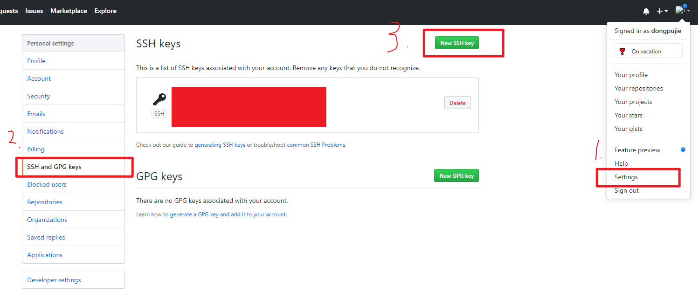
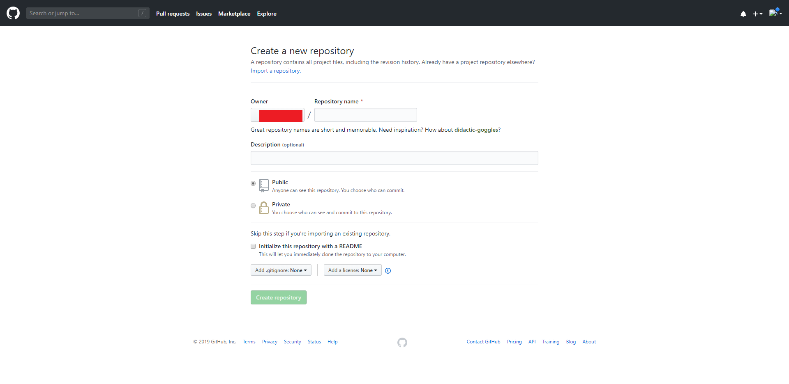

## GIT介绍

 Git是目前世界上最先进的分布式版本控制系统（没有之一）。 

svn是集中式版本控制系统。

分布式版本控制与集中式版本控制的区别：

-  集中式版本控制系统，版本库是集中存放在中央服务器的，而干活的时候，用的都是自己的电脑，所以要先从中央服务器取得最新的版本，然后开始干活，干完活了，再把自己的活推送给中央服务器。 。。 集中式版本控制系统最大的毛病就是必须联网才能工作，如果在局域网内还好，带宽够大，速度够快，可如果在互联网上，遇到网速慢的话，可能提交一个10M的文件就需要5分钟，这还不得把人给憋死啊。 
-  首先，分布式版本控制系统根本没有“中央服务器”，每个人的电脑上都是一个完整的版本库，这样，你工作的时候，就不需要联网了，因为版本库就在你自己的电脑上。既然每个人电脑上都有一个完整的版本库，那多个人如何协作呢？比方说你在自己电脑上改了文件A，你的同事也在他的电脑上改了文件A，这时，你们俩之间只需把各自的修改推送给对方，就可以互相看到对方的修改了。 。。 和集中式版本控制系统相比，分布式版本控制系统的安全性要高很多，因为每个人电脑里都有完整的版本库，某一个人的电脑坏掉了不要紧，随便从其他人那里复制一个就可以了。而集中式版本控制系统的中央服务器要是出了问题，所有人都没法干活了。 


## GIT的安装

推荐参考  https://blog.csdn.net/qq_32786873/article/details/80570783 


## GIT的使用

### 初始化

 通过`git init`命令把目录变成Git可以管理的仓库

```shell
git init
```

### 远程仓库

##### 1. 生成ssh key

```shell
$ ssh-keygen -t rsa -C "youremail@example.com"  # 你自己的邮件地址
```

在C/user  文件夹下有 .ssh文件，其中 `id_rsa`中是私钥，  `id_rsa.pub中`是公钥， 

##### 2. 添加公钥



 当然，GitHub允许你添加多个Key。假定你有若干电脑，你一会儿在公司提交，一会儿在家里提交，只要把每台电脑的Key都添加到GitHub，就可以在每台电脑上往GitHub推送了。 

##### 3.创建仓库

在github中创建仓库



创建完仓库后，可以将远程仓库与本地仓库关联

```shell
git remote add origin git@github.com:你自己的GitHub账户名/仓库名字.git
```

删除关联，如改变仓库名字，重新关联

```shell
git remote rm origin
```


##### 4. 将本地仓库的内容推送到远程仓库

```
git push -u origin master
```

 由于远程库是空的，我们第一次推送`master`分支时，加上了`-u`参数，Git不但会把本地的`master`分支内容推送的远程新的`master`分支，还会把本地的`master`分支和远程的`master`分支关联起来，在以后的推送或者拉取时就可以简化命令。

将本地代码添加到仓库 ，提交

```shell
git add .
git commit -m ""
```


从现在起，只要本地作了提交，就可以通过命令：

```shell
git push origin master -f 	# -f 强制push本地仓库到远程
```

>git clone		从远处仓库克隆到本地
>
>git push 		将本地仓库推送到远程仓库

### 分支管理

##### 创建分支

```shell
git checkout -b dev
```

等于以下两条语句的合并

```shell
git branch dev
git checkout dev
```

##### 查看分支

```shell 
git branch
# 当前分支前会有一个 * 号
```

##### 切换分支

```shell
git checkout 分支名，或者master
```

##### 合并分支

```shell
git merge dev # 合并到主分支
```

##### 删除分支

```shelll
git branch -d dev
```

##### switch

我们注意到切换分支使用`git checkout `，而前面讲过的撤销修改则是`git checkout -- `，同一个命令，有两种作用，确实有点令人迷惑。

实际上，切换分支这个动作，用`switch`更科学。因此，最新版本的Git提供了新的`git switch`命令来切换分支。

>查看分支：`git branch`
>
>创建分支：`git branch `
>
>切换分支：`git checkout `或者`git switch `
>
>创建+切换分支：`git checkout -b `或者`git switch -c `
>
>合并某分支到当前分支：`git merge `
>
>删除分支：`git branch -d `

#### 分支冲突

分支冲突后可直接打开冲突的文件进行修改

 Git用`<<<<<<<`，`=======`，`>>>>>>> `  标记出不同分支的内容，我们可以直接修改后保存 

```
<<<<<<< HEAD
master分支  这是master：
=======
master分支  这是dev。。。
>>>>>>> dev
```

修改如下：

```
<<<<<<< HEAD
master分支  这是master：
=======
master分支  这是master：
>>>>>>> dev
```

查看分支的合并情况

```shell
$ git log --graph --pretty=oneline --abbrev-commit
*   359eb92 (HEAD -> master) 合并
|\
| * 2a1ae49 (dev) dev分支
* | f60224d master分支
|/
* 7fafc58 dev分支
* 2fb6a60 添加空格
* 07c21f4 (origin/master) first commit 2019-11-29
```

#### 分支管理策略

通常，合并分支时，如果可能，Git会用`Fast forward`模式，但这种模式下，删除分支后，会丢掉分支信息。

如果要强制禁用`Fast forward`模式，Git就会在merge时生成一个新的commit，这样，从分支历史上就可以看出分支信息。

合并分支时，加上`--no-ff`参数就可以用普通模式合并，合并后的历史有分支，能看出来曾经做过合并，而`fast forward`合并就看不出来曾经做过合并。

>Fast forward 	快速合并，即将master分支指向dev分支
>
>--no-ff		普通合并， 可以查看分支历史信息

下面我们实战一下`--no-ff`方式的`git merge`：

```shell
git checkout -b dev2
git add README.txt
git commit -m '--no-ff'
git checkout master
git merge --no-ff -m 'merge --no-ff' dev # 普通合并
git log --graph --pretty=oneline --abbrev-commit
```

#### bug分支

没明白。。。。。

保存当前分支的状态


#### 多人协作

- 查看远程库信息，使用`git remote -v`；
- 本地新建的分支如果不推送到远程，对其他人就是不可见的；
- 从本地推送分支，使用`git push origin branch-name`，如果推送失败，先用`git pull`抓取远程的新提交；
- 在本地创建和远程分支对应的分支，使用`git checkout -b branch-name origin/branch-name`，本地和远程分支的名称最好一致；
- 建立本地分支和远程分支的关联，使用`git branch --set-upstream branch-name origin/branch-name`；
- 从远程抓取分支，使用`git pull`，如果有冲突，要先处理冲突。


### 标签管理

#### 创建标签

##### 查看所有标签 

```shell
git tag
```

##### 打上新的标签 

，用`-a`指定标签名，`-m`指定说明文字，  `git tag <name> 可选某个版本`  ，，

- `git tag v1.0 f52e345`
- `git tag -a v-1.1 -m 'version 1.1 released' 234nihoi`

标签不是按时间顺序列出，而是按字母排序的。可以用  `git show <tagname> `  查看标签信息

>  注意：标签总是和某个commit挂钩。如果这个commit既出现在master分支，又出现在dev分支，那么在这两个分支上都可以看到这个标签。

##### 删除标签

```shell
git tag -d v0.1		# 删除本地
git push origin :refs/tags/v0.9		# 删除远程标签
```

##### 推送标签

```shell
git push origin v1.0
git push origin --tags	# 一次性推送全部尚未推送到远程的本地标签
```

