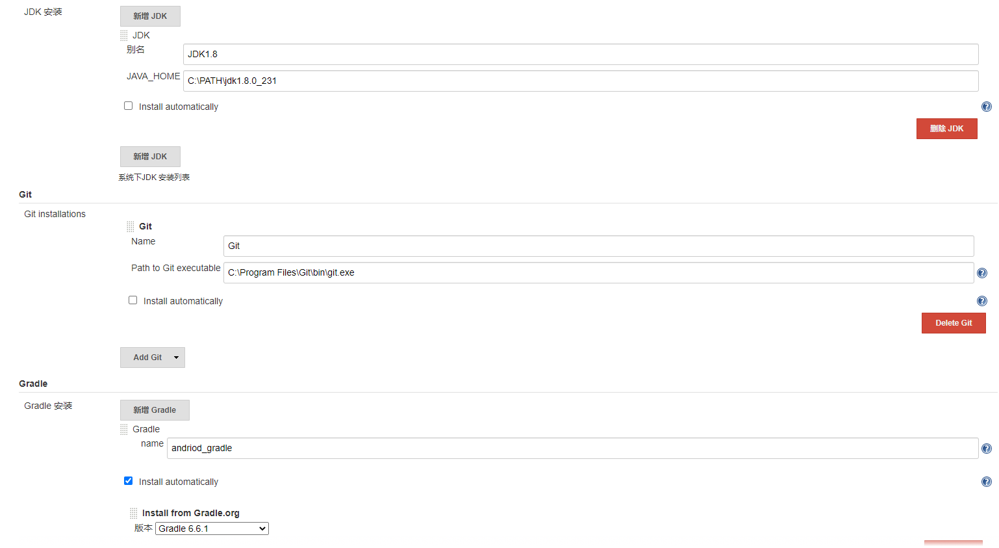
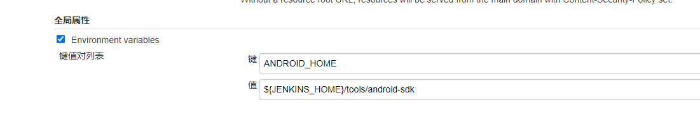
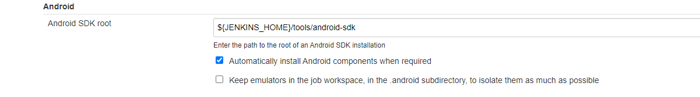
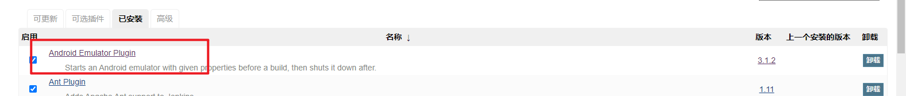
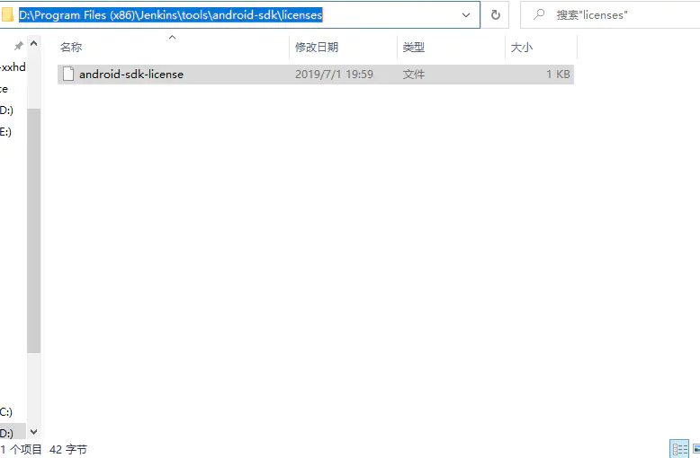
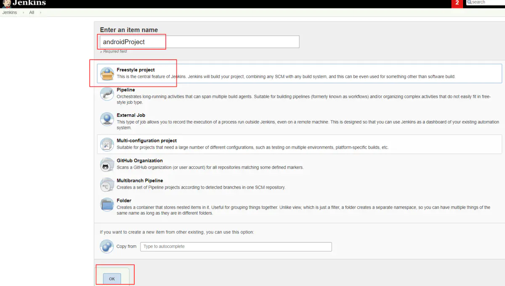
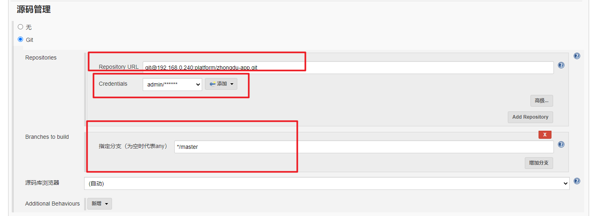
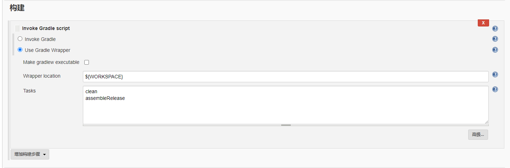
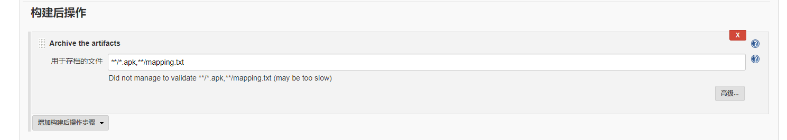

## 构建安卓项目

成功案例：https://www.jianshu.com/p/0c3b7e8c2ab3

### 环境配置

使用Jenkins自动构建，不手动去下载安卓的sdk，但需要android-sdk的证书。

#### Global Tool Configuration




#### Configure System



```
ANDROID_HOME	
${JENKINS_HOME}/tools/android-sdk
```




```
${JENKINS_HOME}/tools/android-sdk
```

#### 插件



```
Android Emulator
```

#### Jenkins安装目录下，创建SDK保存文件目录，很重要

经过反复验证，发现jenkins并不会自动创建上面配置好的路径目录，如果不进行创建，后续编译会报错，找不到对应文件夹，所以我们需要预先到jenkins安装目录下面先创建出android-sdk目录，tools目录默认是没有的，需要自己创建


#### 配置SDK下载许可协议，非常重要

这一步也是非常的重要，否则jenkins无法自动下载SDK，如果忘了配置下载许可协议，后续会遇到如下报错；
 `android-sdk-licennse`文件可从我们已有的sdk文件中复制：
 1、在安装了 Android Studio 的计算机上，依次点击 Tools > Android > SDK Manager。在窗口顶部，记下 Android SDK Location。
 2、转到该目录，并在此目录下找到 licenses/ 目录（如果您没有看到 licenses/ 目录，请返回到 Android Studio 并更新 SDK 工具，确保接受许可协议。返回到 Android SDK 主目录后，您现在应该会看到该目录）。
 3、复制整个 licenses/ 目录，并将其粘贴到jenkins安装目录下，`tools\android-sdk\`里面；
 下图是已经复制完成

```
239服务器放在C:\Users\239\.jenkins\tools\android-sdk\licenses
```

证书文件： [android-sdk-license](android-sdk-license) 

### 构建任务

#### 创建任务



#### GIT配置



#### 构建配置



```
${WORKSPACE}
clean
assembleRelease
```

#### 配置apk输出



```
**/*.apk,**/mapping.txt
```


## 构建IOS项目

