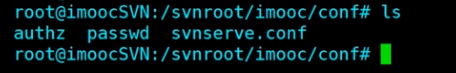

## 服务端与客户端命令

### 服务端命令

svnserver  ---- 控制svn系统服务的启动等

svnadmin  ----  版本库的创建/导出/导入/删除等

svnlook   ----   查看版本库的信息等

### 客户端命令

svn  ----   版本库的检出/更新/提交/重定向等

## 版本库的创建与删除

### 创建版本库 

```shell
svnadmin create /path/repos
# 例：
# 创建一个放置版本库的文件夹
mkdir /svnroot
# 创建一个名为imooc的版本库  绝对路径方式，也可使用相对路径方式
svnadmin create --fs-type fsfs /svnroot/imooc # 其中fsfs是数据保存类型，还有一种dbd，推荐fsfs

```

### 删除版本库

```shell
rm -rvf /path/repos
```


## 版本库配置及权限分组

配置文件位于 /path/repos/conf/



- authz  ----   配置用户组以及用户组权限
- passwd  ----  配置用户名和密码
- svnserve.conf  ----  配置默认权限、权限配置文件及密码配置文件

### svnserve.conf

```shell
# 没有账号密码的用户的权限	其中read为可以从服务器拉取文件，write为可以提交文件到服务器，none没有权限
anon-access = read
# 有账号密码的用户的权限	
auth-access = write

# 用户名及密码配置的文件路径，支持相对、绝对路径
password-db = passwd	# 这个文件必须具有可读写的权限

# 权限分组配置文件的路径，支持相对、绝对路径
authz-db = authz		# 这个文件必须具有可读写的权限

```

### passwd

```shell
# 配置  用户名=密码
[users]
# harry = harryssecret
# sally = sallyssecret
imooc = 123456
imooc2 = 123456
imooc3 = 123456
imooc4 = 123456

```

### authz

```shell
# 别名配置
[aliases]
# joe = /C=XZ/ST=Dessert/L=Snake City/O=Snake Oil, Ltd./OU=Research Institute/CN=Joe Average

# 用户组配置		组名=用户名列表，每个用户名使用`,`隔开，一行表示一个用户组
[groups]
pm = imooc
dev = imooc2,imooc3
rookie = imooc4

# 表示权限 适用为所有的版本库
[/]
@pm = rw
@dev = r
@rookie = r

# 表示权限 只适用为imooc的版本库
[imooc:/]
@pm = rw
imooc2 = rw
imooc3 = rw
imooc4 = 

# 权限 指定更详细的路径分配
[repos:/xxx]
* = r

```


## svn版本库访问

### 运行svn服务

```shell
svnserve -d -r /svnroot/imooc/
```

### svn版本库访问

#### Linux

```shell
mkdir svntest
cd svntest
svn checkout	#等于 svn co
svn co svn://192.168.0.130 --username imooc --password 123456	# 可以写上用户名密码

```

#### windows

小乌龟


## svn服务自启动

系统启动级别

/etc/rc.local 	系统启动之后自动运行一次，绑定了所有自启动软件

在 exit 0 前添加脚本

```shell
svnserve -d -r /svnroot/imooc/
```

https://www.cnblogs.com/airdot/p/9688530.html

## svn术语与文件状态

### 常见术语

版本库、检出、工作副本、更新、提交、版本、版本号

### 文件状态

无版本控制、增加、修改、常规、冲突、删除、锁定


## checkout与export

checkout - 检出		有 .svn 文件

export - 导出		脱离版本控制

```
svn checkout -r 2  // 检出版本2
svn export -r 3	  // 检出版本3

```

.svn 记录着工作副本 **最后一次更新** 后的文件状态

.svn 标记工作副本的一切变化


