# [名称]：Windows10  

[大小]：4.34 GB   

[语言]：简体中文 

[安装环境]：PE系统

# [64位下载链接]：

pan.baidu.com/s/1Q9MVsEzVVoeOb99lQ1tsVQ 

# [提取码]: dggh

# [32位下载链接]：

pan.baidu.com/s/1lhKhb1xpwokvDdSazbjttA 

# [提取码]: gpmc

# [[下载方法\]：](http://mp.weixin.qq.com/s?__biz=MzIwMjE1MjMyMw==&mid=2650202257&idx=1&sn=490890d372654c67e135606afc09e08d&chksm=8ee1407db996c96b00d4815e7bf923189e81f9bb90794a08518cdfab27fbbb98b15e0bfb4476&scene=21#wechat_redirect)[点击查看如何下载软件？](http://mp.weixin.qq.com/s?__biz=MzIwMjE1MjMyMw==&mid=2650202257&idx=1&sn=490890d372654c67e135606afc09e08d&chksm=8ee1407db996c96b00d4815e7bf923189e81f9bb90794a08518cdfab27fbbb98b15e0bfb4476&scene=21#wechat_redirect)

# [备用链接]：若下载链接失效，获取最新下载链接请到公众号『软件安装管家』后台回复：Win10

有任何问题请咨询管家客服👉[**点击咨询**](http://mp.weixin.qq.com/s?__biz=MzIwMjE1MjMyMw==&mid=2650203434&idx=1&sn=1528f7dbfb530d157149662806fdc3b0&chksm=8ee145c6b996ccd0011751e39b6dea0518bbad261c10de98105f8fae43f1227805159685c699&scene=21#wechat_redirect)

温馨

提示

1、此系统为官网原版系统（三合一）即包含教育版、企业版和专业版。

2、安装系统仅C盘（包含了电脑桌面）数据会全部清空，安装系统前请自行备份。

3、我们还提供了迅雷下载链接（迅雷下载链接里只包含系统镜像，不含激活、压缩、驱动等工具，这些工具请到以上百度云链接里下载），你可以通过以上百度云链接进去后下载里面的“迅雷下载地址”文本，把链接复制到迅雷下载系统镜像。

安装

步骤

1.打开下载的文件夹，复制以下内容到制作好的【PE系统】U盘里。

附：[点击查看：](http://mp.weixin.qq.com/s?__biz=MzIwMjE1MjMyMw==&mid=2650203484&idx=2&sn=d558cebdc93f599b29cd8760128371c6&chksm=8ee145b0b996cca651ac7754055782193a8941df99997824889762b7bc0d6928e2e68b361e14&scene=21#wechat_redirect)[如何制作PE系统？](http://mp.weixin.qq.com/s?__biz=MzIwMjE1MjMyMw==&mid=2650203484&idx=2&sn=d558cebdc93f599b29cd8760128371c6&chksm=8ee145b0b996cca651ac7754055782193a8941df99997824889762b7bc0d6928e2e68b361e14&scene=21#wechat_redirect)

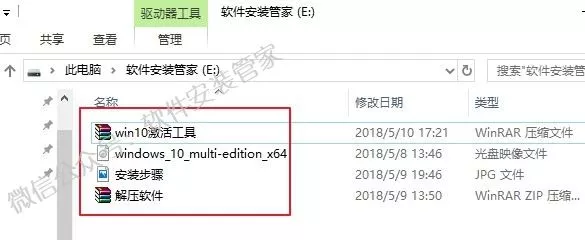

2.设置电脑从U盘启动（常见的方法有两种）：

第一种：开机画面出现立刻按“快捷键”然后选择U盘启动（以下表格可供参考，适用绝大部分机型）。

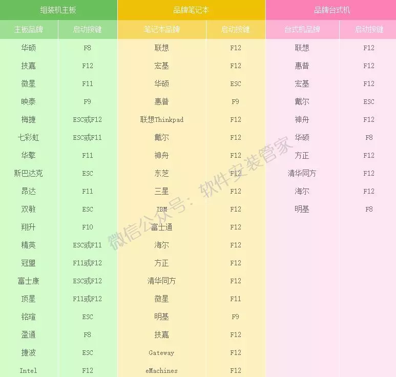

第二种：进入电脑Bios设置U盘为第一启动项（当第一种方法使用快捷键启动无法选择U盘时用此方法设置）。由于不同电脑进入Bios设置U盘启动各有差异，以下仅供参考（建议用户根据自己的电脑品牌自行搜索设置方法）。开机出现Press“ F2” to enter SETUP 时，按F2键（具体以自己的电脑开机显示为准）。按键盘上的方向键切换到“BOOT”项，点击“Hard Disk Drives”，将“1ST BOOT” 修改为“USB HDD”按F10保存更改，重启时就会自动进入PE系统。

3.重启电脑，在开机画面出来的时候按【快捷键】选择U盘启动（以组装台式机微星主板为例，开机按F11）。

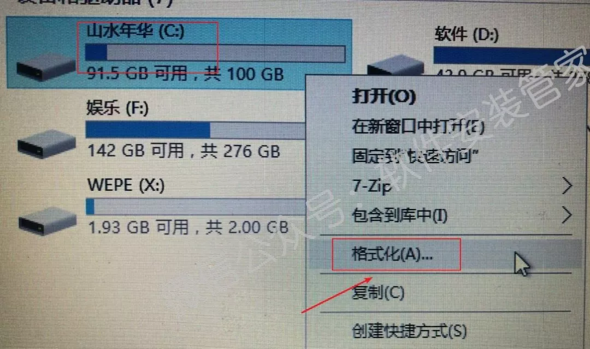

4.在键盘上按上下方向键"↑↓"选择到U盘启动（选项有显示USB或你U盘品牌英文名称），我这里选择【UEFI】：Teclast CoolFlash USB3.0"，按【Enter】键后电脑进入PE。

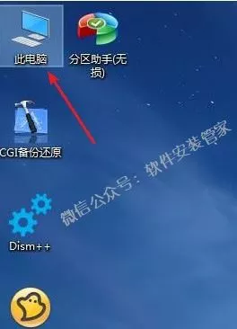

5.进入PE系统后，格式化系统盘。

1）点击桌面【此电脑】。

2）鼠标右击【C】盘，选择【格式化（A)……】。

3）点击【开始】。

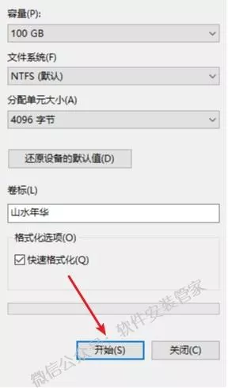

4）点击【确定】。

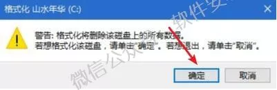

5）格式化完成，点击【确定】。

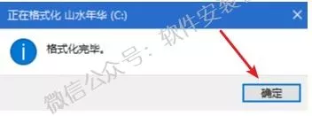

6.双击打开桌面的【Windows安装器】。

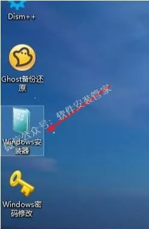

7.选择【包含Windows安装文件夹】。

1）点击【选择】。

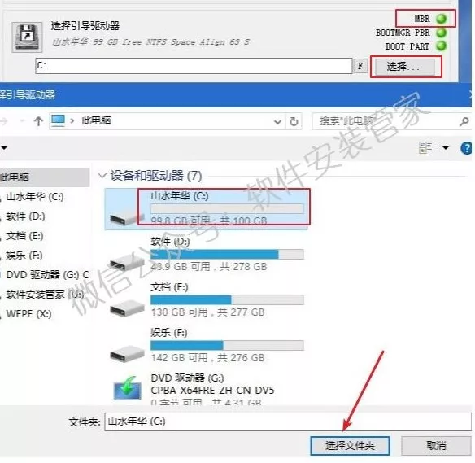

2）打开U盘所在位置，选择【windows_10.......iso】系统映像，点击【打开】。

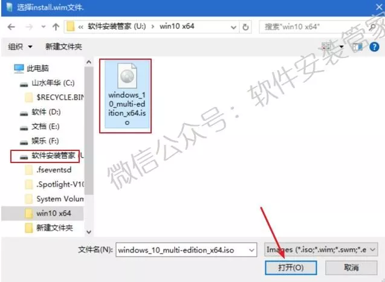

8.【选择引导驱动器】。

1）若图中绿灯处显示为“MBR”：点击【选择】，选择【C】盘，再点击【选择文件夹】。

2）若图中绿灯处显示为“GPT”：点击【选择】，选择“一个300MB左右的盘，一般情况下为最后一个盘”，我这里为【Z】盘，点击【选择文件夹】。

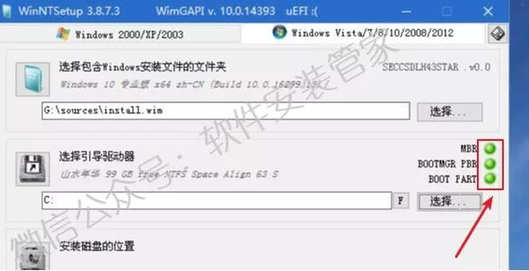

3）当图中的三个灯不出现红灯（绿灯和黄灯均为正常）说明驱动器磁盘选择正确；若亮红灯说明选择引导驱动器磁盘选择错误。请重新选择引导驱动器磁盘，直到选择磁盘后不出现红灯。

9.【安装磁盘的位置】选择【C】盘：点击【选择】，选择【C】盘，再点击【选择文件夹】。

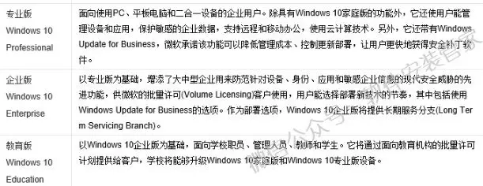

10.选择自己所需要安装的版本（我这里选择Windows 10 企业版），点击【开始安装】。

附：Windows10各版本介绍，供你参考。

11.点击【确定】。

12.正在应用Windows映像文件(大约需要5分钟）。

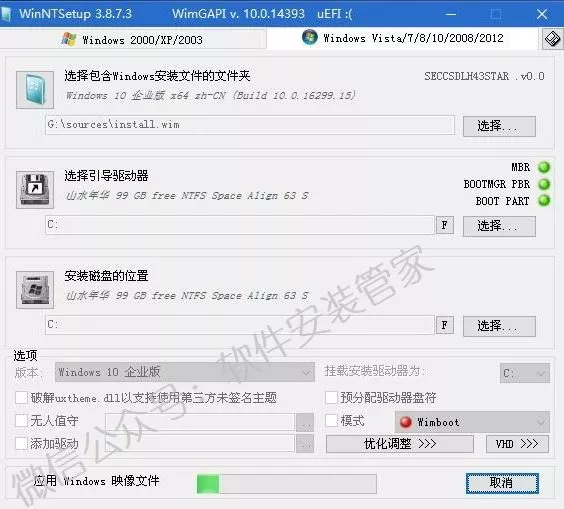

13.提示“已完成”，此时拔掉U盘，点击【重启】。

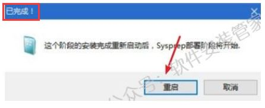

若点击“重启”后电脑未能重新启动，点击左下角图标，点击【重启】即可。

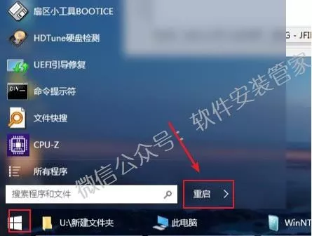

14.系统正在安装，期间电脑会重启数次。

15.区域设置：我这里选择【中国】，点击【是】。

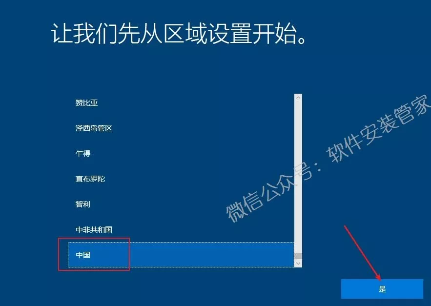

16.选择输入法：我这里选择【微软拼音】，点击【是】。

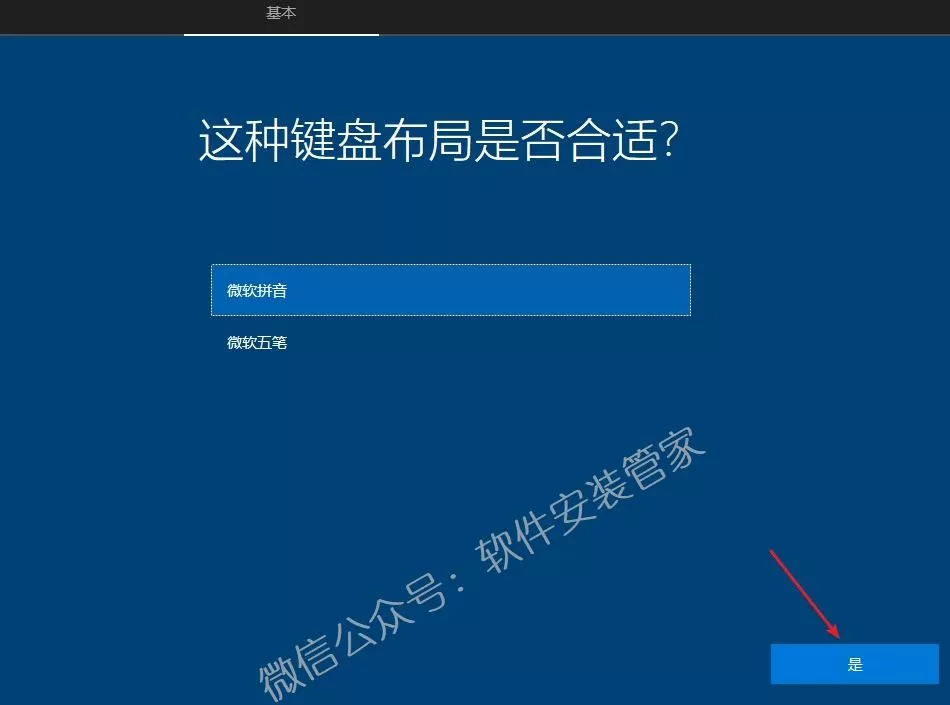

17.点击【跳过】。

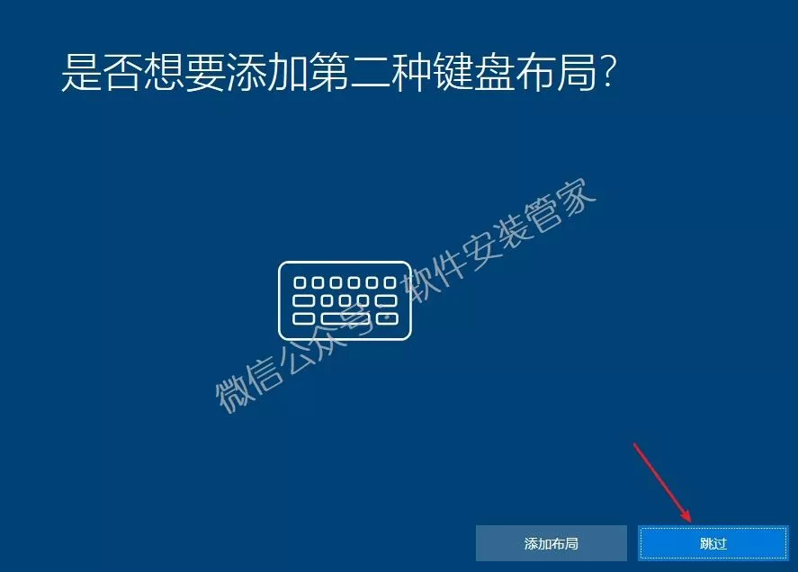

18.点击【改为域加入】。

19.设置账户名称，点击【下一步】。

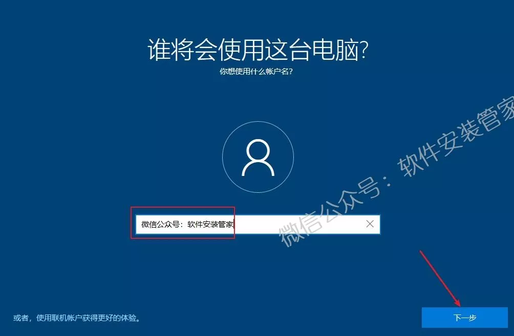

20.设置账户密码（电脑开机时需要此密码），直接点击【下一步】可设置开机无需密码。

21.自行选择是否需要Cortana个人助理（我这里选择否）。

22.保持默认，点击【接受】。

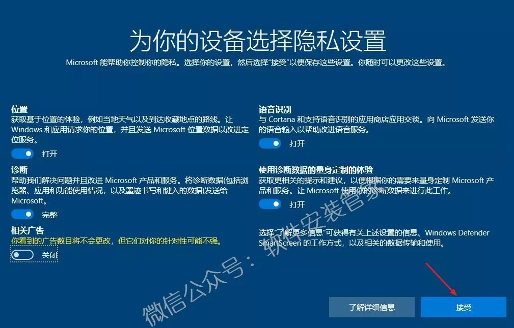

23.系统配置中。

24.安装完成，如下图所示。

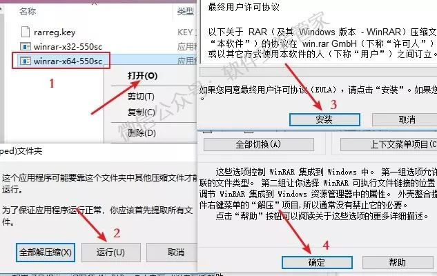

25.安装解压软件（解压软件在下载的文件夹里有附带，你也可以根据自己的使用习惯自行下载安装）。

1）打开U盘所在路径，双击【解压软件】。

2）若你安装的是64位操作系统，右击【winrar-x64】打开运行；若你安装的是32位操作系统，右击【winrar-x32】打开运行，具体安装方法如下所示。

26.激活系统。

**方法一：**

1）打开U盘所在位置，鼠标右击【Win10激活工具】压缩包，选择【解压到Win10激活工具】。

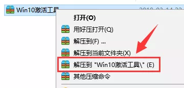

2）打开解压后的文件夹，鼠标右击【License1】，选择【以管理员身份运行】。

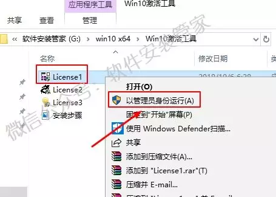

3）点击【激活】。

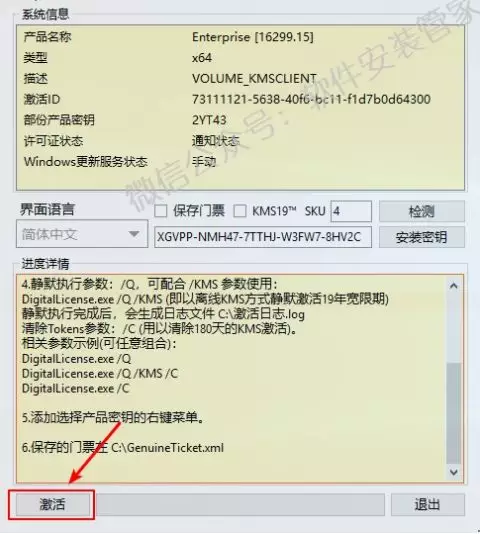

4）当显示【成功地激活了产品】证明激活成功，点击【退出】。若激活失败，尝试方法二。

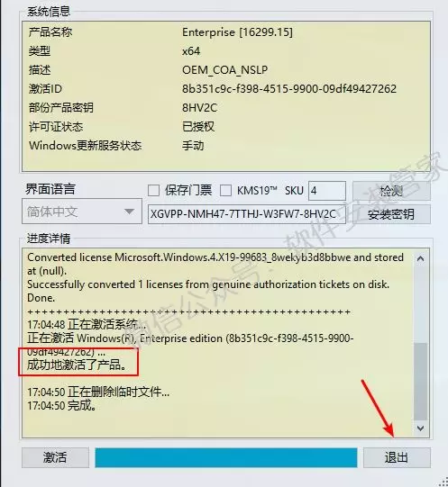

**方法二：**

1）打开解压后的【Win10激活工具】文件夹，鼠标右击【License2】，选择【以管理员身份运行】。

2）点击【激活 Windows 10 /8/7 ALL】，激活成功，点击【退出程序】。若激活失败，尝试方法三。

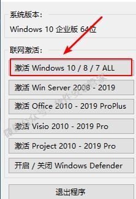

**方法三：**

1）打开解压后的【Win10激活工具】文件夹，鼠标右击【License3】，选择【以管理员身份运行】。

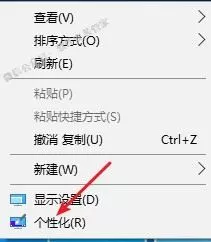

2）点击【PATCH】。  

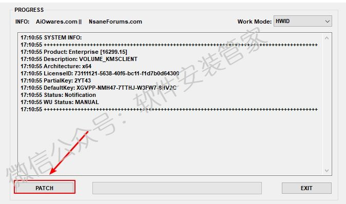

3）提示【Successfully……】证明激活成功，点击【确定】。

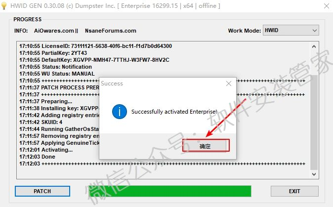

27.我们来验证一下系统是否激活成功。

1）在桌面空白处点击鼠标“右键”，点击【个性化】。

2）选择【主题】，点击【桌面图标设置】。

3）勾选【计算机】，点击【确定】。

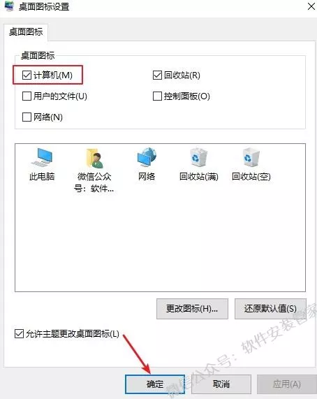

4）在电脑鼠标右击【此电脑】，点击【属性】。

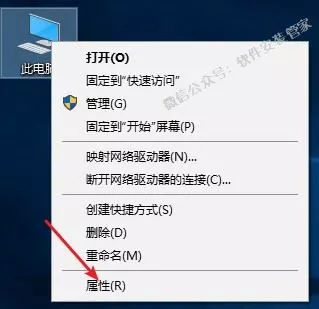

27.激活成功，如下图所示。

