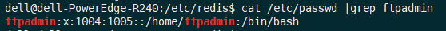
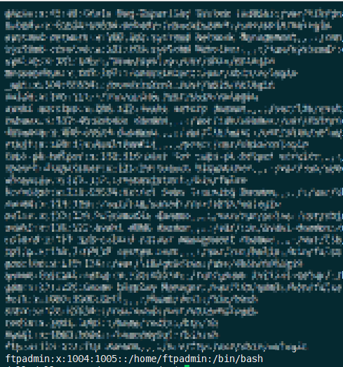
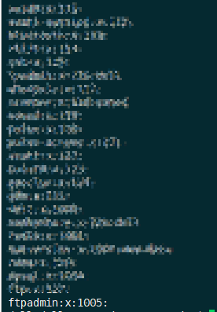

## 参考

https://www.ilanni.com/?p=10071

https://www.linuxidc.com/Linux/2018-08/153492.htm

https://www.zcfy.cc/article/how-to-install-and-configure-ftp-server-in-ubuntu#

https://murphypei.github.io/blog/2019/02/vsftpd

centos：https://www.ilanni.com/?p=5341

## 需求

现在需要在Ubuntu18.04服务器下创建一个文件夹`zdyg`，下面有文件夹`yunying`和`jishu`，要求技术人员只能访问文件夹`jishu`，运营人员只能访问文件夹`yunying`，老板可以访文件夹`zdyg`下的所有文件。

## 安装

直接使用apt-get进行安装：`sudo apt-get -y install vsftpd`

查看vsftpd都安装了那些文件：`dpkg -L vsftpd |tac`


/etc/vsftpd.conf是vsftpd的配置文件。这里和centos不同，不能将配置文件放入到/etc/vsftpd/目录下。

#### 启动/停止

```shell
sudo service vsftpd stop	# 停止

sudo service vsftpd start	# 启动

sudo service vsftpd restart	# 重启
```

#### 查看vsftpd的服务脚本

```shell
cat /lib/systemd/system/vsftpd.service
```


## 配置

vsftpd安装完毕后，我们现在开始配置vsftpd，不过在正式配置之前，我们还有几步工作要做。

### 用户相关配置

因为是使用vsftpd的虚拟用户，所以我们需要先在系统中创建一个用户，并且该用户对/www目录具有可读可写可执行权限。

#### 创建用户，如下：

```shell
sudo useradd -m -s /bin/bash ftpadmin
cat /etc/passwd |grep ftpadmin
```



>创建的用户ftpadmin现在是无法登录到系统的，因为没有给该用户设置密码。在此，我们也无需ftpadmin登录到系统，这样相对来说比较安全。

用户创建完毕后，我们来创建对应的目录并修改其所属用户，如下：

```shell
sudo mkdir /zdyg
# 将文件权限改为刚刚创建的ftpadmin用户（：前的ftpadmin为用户，：后的ftpadmin为用户所在组，在此使用的是虚拟用户，不对用户分组）
sudo chown -R ftpadmin:ftpadmin /zdyg/
sudo chmod 777 /zdyg/	#修改文件权限
```

#### 有关用户相关配置结束后，我们开始设置登录vsftp的用户与密码文件login.txt。如下：

```shell
sudo mkdir /etc/vsftpd/

sudo vim /etc/vsftpd/login.txt	# 存放用户名与密码
```

在 `/etc/vsftpd/login.txt` 文件中添加如下：(一行账号，一行密码)

```
yunying			# 运营账号
yunyingpasswd	# 运营密码
guanli			# 管理账号
guanlipasswd	# 管理密码
jishu			# 技术账号
jishupasswd		# 技术密码
```

#### login.txt设置完毕后，我们要使用db_load进行加密。而db_load需要db-util这个软件。所以需要我们现在安装db-util，如下：

> centos 不需要安装db-util。可以直接执行 db_load

```shell
sudo apt-get -y install db-util
```

db-util安装完毕后，现在开始使用db_load对loginx.txt进行加密。如下：

```shell
sudo db_load -T -t hash -f /etc/vsftpd/login.txt /etc/vsftpd/login.db
```

> 需要注意的是，以后对虚拟用户的增删操作完之后需要再次执行上述命令，使其生成新的数据文件。

loginx.txt加密完成后，我们现在开始配置vsftpd的PAM验证。

### PAM验证配置

vsftpd的PAM验证，这里没有使用vsftpd安装时所生成的/etc/pam.d/vsftpd文件。因为经过多次的测试，发现如果使用该文件进行验证的话，无法验证通过。不知道为什么，猜想很有可能是vsftpd的一个BUG。

创建验证文件，如下：

```shell
sudo vim /etc/pam.d/vsftpd.virtual
```

文件中添加内容：

```
auth required pam_userdb.so db=/etc/vsftpd/login

account required pam_userdb.so db=/etc/vsftpd/login
```

vsftpd.virtual文件的内容，也可以根据OS的版本进行调整。我现在使用的是ubuntu x64，所以也可以填写为：

```
auth required /lib/x86_64-linux-gnu/security/pam_userdb.so db=/etc/vsftpd/login

account required /lib/x86_64-linux-gnu/security/pam_userdb.so db=/etc/vsftpd/login
```

> 其中/etc/vsftpd/login对应/etc/vsftpd/login.db文件

### vsftp权限配置

现在正式配置vsftpd，vsftpd的几乎所有配置项都在/etc/vsftpd.conf文件中进行。

根据业务要求vsftpd.conf配置内容如下：

```shell
# 查看vsftpd.conf中的配置
grep -vE "^#|^$" /etc/vsftpd.conf
```

配置如下：

```
listen=YES	#默认
listen_ipv6=NO	#默认
anonymous_enable=NO	#设置为NO代表不允许匿名
local_enable=YES	#设定本地用户可以访问，主要是虚拟宿主用户，如果设为NO那么所有虚拟用户将无法访问。
write_enable=YES	#可以进行写的操作，此项一定要为YES，否则不能上传文件
local_umask=022		#设定上传文件的权限掩码，022对应755
dirmessage_enable=YES	# 设定开启目录标语功能
use_localtime=YES	# 时间设置
xferlog_enable=YES	# 设定开启日志记录功能
connect_from_port_20=YES	#设定端口20进行数据连接
xferlog_file=/var/log/vsftpd.log	#设定vsftpd服务日志保存路劲。注意：该文件默认不存在，需手动touch，且由于这里更改了vsftpd服务的宿主用户为手动建立的vsftpd，则必须注意给予该用户对日志的读取权限否则服务启动失败。
xferlog_std_format=YES	#设定日志使用标准的记录格式

chroot_local_user=YES	#是否将所有用户限制在主目录，YES 为启用 NO 禁用（该项默认值是 NO，即在安装 vsftpd 后不做配置的话，ftp 用户是可以向上切换到要目录之外的）
chroot_list_enable=NO	#是否启动限制用户的名单 YES 为启用 NO 禁用（包括注释掉也为禁用）

allow_writeable_chroot=YES	#允许写操作
secure_chroot_dir=/var/run/vsftpd/empty	# 默认
pam_service_name=vsftpd	# 默认
rsa_cert_file=/etc/ssl/certs/ssl-cert-snakeoil.pem	# 默认
rsa_private_key_file=/etc/ssl/private/ssl-cert-snakeoil.key	# 默认
ssl_enable=NO	# 默认
guest_enable=YES	#启用vsftpd虚拟用户
pam_service_name=vsftpd.virtual	#PAM验证文件
user_config_dir=/etc/vsftpd/vu	#虚拟用户账号配置目录
pasv_enable=YES	#下面三项是启用vsftpd被动模式及相关端口
pasv_enable=YES
pasv_min_port=30000
pasv_max_port=31000

```

在以上配置文件中，有几点需要重点指出。

```
local_enable=YES
write_enable=YES
local_umask=022
这两项是启用系统用户的写权限。特别是write_enable=YES项一定要启用，否则vsftpd虚拟用户将无法登录vsftpd。
为什么会是这样？因为虚拟用户依赖与系统用户。

chroot_local_user=YES
chroot_list_enable=NO
allow_writeable_chroot=YES
这三项是配置vsftpd用户禁止切换上级目录的权限。

guest_enable=YES
pam_service_name=vsftpd.virtual
user_config_dir=/etc/vsftpd/vu
这三项是启用vsftpd虚拟用以及虚拟用户账号配置目录。

pasv_enable=YES
pasv_min_port=30000
pasv_max_port=31000
这三项是启用vsftpd被动模式及相关端口。
```

### 附

```
vsftpd配置文件详解
 
1.默认配置：
1>允许匿名用户和本地用户登陆。
     anonymous_enable=YES
     local_enable=YES
2>匿名用户使用的登陆名为ftp或anonymous，口令为空；匿名用户不能离开匿名用户家目录/var/ftp,且只能下载不能上传。
3>本地用户的登录名为本地用户名，口令为此本地用户的口令；本地用户可以在自 己家目录中进行读写操作；本地用户可以离开自家目录切换至有权限访问的其他目录，并在权限允许的情况下进行上传/下载。
    write_enable=YES
4>写在文件/etc/vsftpd.ftpusers中的本地用户禁止登陆。
            
2.配置文件格式：  
vsftpd.conf 的内容非常单纯，每一行即为一项设定。若是空白行或是开头为#的一行，将会被忽略。内容的格式只有一种，如下所示
option=value
要注意的是，等号两边不能加空白。
 
3.匿名用户（anonymous）设置
anonymous_enable=YES/NO（YES）
控制是否允许匿名用户登入，YES 为允许匿名登入，NO 为不允许。默认值为YES。
write_enable=YES/NO（YES）
是否允许登陆用户有写权限。属于全局设置，默认值为YES。
no_anon_password=YES/NO（NO）
若是启动这项功能，则使用匿名登入时，不会询问密码。默认值为NO。
ftp_username=ftp
定义匿名登入的使用者名称。默认值为ftp。
anon_root=/var/ftp
使用匿名登入时，所登入的目录。默认值为/var/ftp。注意ftp目录不能是777的权限属性，即匿名用户的家目录不能有777的权限。
anon_upload_enable=YES/NO（NO）
如果设为YES，则允许匿名登入者有上传文件（非目录）的权限，只有在write_enable=YES时，此项才有效。当然，匿名用户必须要有对上层目录的写入权。默认值为NO。
anon_world_readable_only=YES/NO（YES）
如果设为YES，则允许匿名登入者下载可阅读的档案（可以下载到本机阅读，不能直接在FTP服务器中打开阅读）。默认值为YES。
anon_mkdir_write_enable=YES/NO（NO）
如果设为YES，则允许匿名登入者有新增目录的权限，只有在write_enable=YES时，此项才有效。当然，匿名用户必须要有对上层目录的写入权。默认值为NO。
anon_other_write_enable=YES/NO（NO）
如果设为YES，则允许匿名登入者更多于上传或者建立目录之外的权限，譬如删除或者重命名。（如果anon_upload_enable=NO，则匿名用户不能上传文件，但可以删除或者重命名已经存在的文件；如果anon_mkdir_write_enable=NO，则匿名用户不能上传或者新建文件夹，但可以删除或者重命名已经存在的文件夹。）默认值为NO。
chown_uploads=YES/NO（NO）
设置是否改变匿名用户上传文件（非目录）的属主。默认值为NO。
chown_username=username
设置匿名用户上传文件（非目录）的属主名。建议不要设置为root。
anon_umask=077
设置匿名登入者新增或上传档案时的umask 值。默认值为077，则新建档案的对应权限为700。
deny_email_enable=YES/NO（NO）
若是启动这项功能，则必须提供一个档案/etc/vsftpd/banner_emails，内容为email address。若是使用匿名登入，则会要求输入email address，若输入的email address 在此档案内，则不允许进入。默认值为NO。
banned_email_file=/etc/vsftpd/banner_emails
此文件用来输入email address，只有在deny_email_enable=YES时，才会使用到此档案。若是使用匿名登入，则会要求输入email address，若输入的email address 在此档案内，则不允许进入。
 
4.本地用户设置
local_enable=YES/NO（YES）
控制是否允许本地用户登入，YES 为允许本地用户登入，NO为不允许。默认值为YES。
local_root=/home/username
当本地用户登入时，将被更换到定义的目录下。默认值为各用户的家目录。
write_enable=YES/NO（YES）
是否允许登陆用户有写权限。属于全局设置，默认值为YES。
local_umask=022
本地用户新增档案时的umask 值。默认值为077。
file_open_mode=0755
本地用户上传档案后的档案权限，与chmod 所使用的数值相同。默认值为0666。
 
5.欢迎语设置
dirmessage_enable=YES/NO（YES）
如果启动这个选项，那么使用者第一次进入一个目录时，会检查该目录下是否有.message这个档案，如果有，则会出现此档案的内容，通常这个档案会放置欢迎话语，或是对该目录的说明。默认值为开启。
message_file=.message
设置目录消息文件，可将要显示的信息写入该文件。默认值为.message。
banner_file=/etc/vsftpd/banner
当使用者登入时，会显示此设定所在的档案内容，通常为欢迎话语或是说明。默认值为无。如果欢迎信息较多，则使用该配置项。
ftpd_banner=Welcome to BOB's FTP server
这里用来定义欢迎话语的字符串，banner_file是档案的形式，而ftpd_banner 则是字符串的形式。预设为无。
 
6.控制用户是否允许切换到上级目录
在默认配置下，本地用户登入FTP后可以使用cd命令切换到其他目录，这样会对系统带来安全隐患。可以通过以下三条配置文件来控制用户切换目录。
chroot_list_enable=YES/NO（NO）
设置是否启用chroot_list_file配置项指定的用户列表文件。默认值为NO。
chroot_list_file=/etc/vsftpd.chroot_list
用于指定用户列表文件，该文件用于控制哪些用户可以切换到用户家目录的上级目录。
chroot_local_user=YES/NO（NO）
用于指定用户列表文件中的用户是否允许切换到上级目录。默认值为NO。
通过搭配能实现以下几种效果：
①当chroot_list_enable=YES，chroot_local_user=YES时，在/etc/vsftpd.chroot_list文件中列出的用户，可以切换到其他目录；未在文件中列出的用户，不能切换到其他目录。
②当chroot_list_enable=YES，chroot_local_user=NO时，在/etc/vsftpd.chroot_list文件中列出的用户，不能切换到其他目录；未在文件中列出的用户，可以切换到其他目录。
③当chroot_list_enable=NO，chroot_local_user=YES时，所有的用户均不能切换到其他目录。
④当chroot_list_enable=NO，chroot_local_user=NO时，所有的用户均可以切换到其他目录。
 
7.数据传输模式设置
FTP在传输数据时，可以使用二进制方式，也可以使用ASCII模式来上传或下载数据。
ascii_upload_enable=YES/NO（NO）
设置是否启用ASCII 模式上传数据。默认值为NO。
ascii_download_enable=YES/NO（NO）
设置是否启用ASCII 模式下载数据。默认值为NO。
 
8.访问控制设置
两种控制方式：一种控制主机访问，另一种控制用户访问。
①控制主机访问：
tcp_wrappers=YES/NO（YES）
设置vsftpd是否与tcp wrapper相结合来进行主机的访问控制。默认值为YES。如果启用，则vsftpd服务器会检查/etc/hosts.allow 和/etc/hosts.deny 中的设置，来决定请求连接的主机，是否允许访问该FTP服务器。这两个文件可以起到简易的防火墙功能。
比如：若要仅允许192.168.0.1—192.168.0.254的用户可以连接FTP服务器，则在/etc/hosts.allow文件中添加以下内容：
vsftpd:192.168.0. :allow
all:all :deny
②控制用户访问：
对于用户的访问控制可以通过/etc目录下的vsftpd.user_list和ftpusers文件来实现。
userlist_file=/etc/vsftpd.user_list
控制用户访问FTP的文件，里面写着用户名称。一个用户名称一行。
userlist_enable=YES/NO（NO）
是否启用vsftpd.user_list文件。
userlist_deny=YES/NO（YES）
决定vsftpd.user_list文件中的用户是否能够访问FTP服务器。若设置为YES，则vsftpd.user_list文件中的用户不允许访问FTP，若设置为NO，则只有vsftpd.user_list文件中的用户才能访问FTP。
/etc/vsftpd/ftpusers文件专门用于定义不允许访问FTP服务器的用户列表（注意:如果userlist_enable=YES,userlist_deny=NO,此时如果在vsftpd.user_list和ftpusers中都有某个用户时，那么这个用户是不能够访问FTP的，即ftpusers的优先级要高）。默认情况下vsftpd.user_list和ftpusers，这两个文件已经预设置了一些不允许访问FTP服务器的系统内部账户。如果系统没有这两个文件，那么新建这两个文件，将用户添加进去即可。
 
9.访问速率设置
anon_max_rate=0
设置匿名登入者使用的最大传输速度，单位为B/s，0 表示不限制速度。默认值为0。
local_max_rate=0
本地用户使用的最大传输速度，单位为B/s，0 表示不限制速度。预设值为0。
 
10.超时时间设置
accept_timeout=60
设置建立FTP连接的超时时间，单位为秒。默认值为60。
connect_timeout=60
PORT 方式下建立数据连接的超时时间，单位为秒。默认值为60。
data_connection_timeout=120
设置建立FTP数据连接的超时时间，单位为秒。默认值为120。
idle_session_timeout=300
设置多长时间不对FTP服务器进行任何操作，则断开该FTP连接，单位为秒。默认值为300 。
 
11.日志文件设置
xferlog_enable= YES/NO（YES）
是否启用上传/下载日志记录。如果启用，则上传与下载的信息将被完整纪录在xferlog_file 所定义的档案中。预设为开启。
xferlog_file=/var/log/vsftpd.log
设置日志文件名和路径，默认值为/var/log/vsftpd.log。
xferlog_std_format=YES/NO（NO）
如果启用，则日志文件将会写成xferlog的标准格式，如同wu-ftpd 一般。默认值为关闭。
log_ftp_protocol=YES|NO（NO）
如果启用此选项，所有的FTP请求和响应都会被记录到日志中，默认日志文件在/var/log/vsftpd.log。启用此选项时，xferlog_std_format不能被激活。这个选项有助于调试。默认值为NO。
 
12.定义用户配置文件
在vsftpd中，可以通过定义用户配置文件来实现不同的用户使用不同的配置。
user_config_dir=/etc/vsftpd/userconf
设置用户配置文件所在的目录。当设置了该配置项后，用户登陆服务器后，系统就会到/etc/vsftpd/userconf目录下，读取与当前用户名相同的文件，并根据文件中的配置命令，对当前用户进行更进一步的配置。
例如：定义user_config_dir=/etc/vsftpd/userconf，且主机上有使用者 test1,test2，那么我们就在user_config_dir 的目录新增文件名为test1和test2两个文件。若是test1 登入，则会读取user_config_dir 下的test1 这个档案内的设定。默认值为无。利用用户配置文件，可以实现对不同用户进行访问速度的控制，在各用户配置文件中定义local_max_rate=XX，即可。
 
13.FTP的工作方式与端口设置
FTP有两种工作方式：PORT FTP（主动模式）和PASV FTP（被动模式）
listen_port=21
设置FTP服务器建立连接所监听的端口，默认值为21。
connect_from_port_20=YES/NO
指定FTP使用20端口进行数据传输，默认值为YES。
ftp_data_port=20
设置在PORT方式下，FTP数据连接使用的端口，默认值为20。
pasv_enable=YES/NO（YES）
若设置为YES，则使用PASV工作模式；若设置为NO，则使用PORT模式。默认值为YES，即使用PASV工作模式。
pasv_max_port=0
在PASV工作模式下，数据连接可以使用的端口范围的最大端口，0 表示任意端口。默认值为0。
pasv_min_port=0
在PASV工作模式下，数据连接可以使用的端口范围的最小端口，0 表示任意端口。默认值为0。
 
14.与连接相关的设置
listen=YES/NO（YES）
设置vsftpd服务器是否以standalone模式运行。以standalone模式运行是一种较好的方式，此时listen必须设置为YES，此为默认值。建议不要更改，有很多与服务器运行相关的配置命令，需要在此模式下才有效。若设置为NO，则vsftpd不是以独立的服务运行，要受到xinetd服务的管控，功能上会受到限制。
max_clients=0
设置vsftpd允许的最大连接数，默认值为0，表示不受限制。若设置为100时，则同时允许有100个连接，超出的将被拒绝。只有在standalone模式运行才有效。
max_per_ip=0
设置每个IP允许与FTP服务器同时建立连接的数目。默认值为0，表示不受限制。只有在standalone模式运行才有效。
listen_address=IP地址
设置FTP服务器在指定的IP地址上侦听用户的FTP请求。若不设置，则对服务器绑定的所有IP地址进行侦听。只有在standalone模式运行才有效。
setproctitle_enable=YES/NO（NO）
设置每个与FTP服务器的连接，是否以不同的进程表现出来。默认值为NO，此时使用ps aux |grep ftp只会有一个vsftpd的进程。若设置为YES，则每个连接都会有一个vsftpd的进程。
 
15.虚拟用户设置
虚拟用户使用PAM认证方式。
pam_service_name=vsftpd
设置PAM使用的名称，默认值为/etc/pam.d/vsftpd。
guest_enable= YES/NO（NO）
启用虚拟用户。默认值为NO。
guest_username=ftp
这里用来映射虚拟用户。默认值为ftp。
virtual_use_local_privs=YES/NO（NO）
当该参数激活（YES）时，虚拟用户使用与本地用户相同的权限。当此参数关闭（NO）时，虚拟用户使用与匿名用户相同的权限。默认情况下此参数是关闭的（NO）。
 
16.其他设置
text_userdb_names= YES/NO（NO）
设置在执行ls –la之类的命令时，是显示UID、GID还是显示出具体的用户名和组名。默认值为NO，即以UID和GID方式显示。若希望显示用户名和组名，则设置为YES。
ls_recurse_enable=YES/NO（NO）
若是启用此功能，则允许登入者使用ls –R（可以查看当前目录下子目录中的文件）这个指令。默认值为NO。
hide_ids=YES/NO（NO）
如果启用此功能，所有档案的拥有者与群组都为ftp，也就是使用者登入使用ls -al之类的指令，所看到的档案拥有者跟群组均为ftp。默认值为关闭。
download_enable=YES/NO（YES）
如果设置为NO，所有的文件都不能下载到本地，文件夹不受影响。默认值为YES。
```


### 虚拟用户配置

vsftpd配置文件修改文件后，现在开始配置虚拟用户的相关权限。如下：

```shell
sudo mkdir /etc/vsftpd/vu
sudo vim /etc/vsftpd/vu/guanli
```

配置如下：（guanli可访问的配置）

```shell
guest_username=ftpadmin
local_root=/zdyg/
virtual_use_local_privs=YES
anon_umask=133

write_enable=YES
anon_world_readable_only=NO
anon_upload_enable=YES
anon_mkdir_write_enable=YES
anon_other_write_enable=YES

```

运营账号配置

```shell
sudo vim /etc/vsftpd/vu/yunying

配置如下：
guest_username=ftpadmin
local_root=/zdyg/yunying/
virtual_use_local_privs=YES
anon_umask=133
```

技术账号配置

```shell
sudo vim /etc/vsftpd/vu/jishu

配置如下：
guest_username=ftpadmin
local_root=/zdyg/jishu/
virtual_use_local_privs=YES
anon_umask=133
```

> 以上配置参数，其中guest_username=ftpilanni表示的是设置FTP对应的系统用户为ftpadmin
>
> local_root=/zdyg/表示使用本地用户登录到ftp时的默认目录。
>
> virtual_use_local_privs=YES虚拟用户和本地用户有相同的权限。
>
> anon_umask表示文件上传的默认掩码。计算方式是777减去anon_umask就是上传文件的权限。在此我们设置的是133，也就是说上传后文件的权限是644。即上传的文件对所属用户来说只有读写权限，没有执行权限。

以上全部配置完毕后，我们来重启vsftpd，如下：

```shell
sudo service vsftpd restart
```


## 删除

卸载FTP

```shell
sudo apt-get remove --purge vsftpd
(--purge 选项表示彻底删除改软件和相关文件)
```

删除用户：

```shell
sudo vim /etc/passwd	#进入用户配置文件，找到并删除需要删除的用户
```



删除组：

```shell
sudo vim /etc/group		#进入用户组配置文件，找到并删除需要删除的用户组
```



## FTP外网访问

参考：http://www.nat123.com/pages_17_600.jsp

安装nat123，通过设置DNS域名来进行外网访问。

查看操作系统版本：`uname -r`		或用uname -a，或cat /proc/version

#### 安装运行环境

```shell
sudo apt-get update
sudo apt-get install mono-complete
mono  -V                 # ——查看安装运行环境版本信息，注意是大写的V字母
```

#### 客户端安装

```shell
cd /usr/local
sudo mkdir nat123	# 创建一个nat123文件夹
cd /nat123			# 在新创建文件夹下执行安装等操作
sudo wget http://www.nat123.com/down/nat123linux.tar.gz	# 下载安装包。过程中可能会有转跳提示，忽略它
tar  -zxvf  nat123linux.tar.gz	# 解压本地目录
```

#### 客户端启动

```shell
cd /usr/local/nat123
sudo mono nat123linux.sh	# 运行客户端，并按提示依次输入自己的帐号和密码
sudo mono  nat123linux.sh service &    # 后台服务方式启动，自动读取上次成功登录帐号

ps  -ef|grep  nat123	# 查看服务
```

#### FTP访问者设置

参考：http://www.nat123.com/pages_23_537.jsp

域名：34g0c029f.nat123.net		端口：21

#### 自启动

参考：https://www.jianshu.com/p/79d24b4af4e5

​			http://www.nat123.com/Pages_17_619.jsp

配置目录：/etc/rc.local

1. 建立rc-local.service文件

```
sudo vi /etc/systemd/system/rc-local .service
```

2. 将下列内容复制进rc-local.service文件

```shell
[Unit]
Description=/etc/rc.local Compatibility
ConditionPathExists=/etc/rc.local
 
[Service]
Type=forking
ExecStart=/etc/rc.local start
TimeoutSec=0
StandardOutput=tty
RemainAfterExit=yes
SysVStartPriority=99
 
[Install]
WantedBy=multi-user.target
```

3. 创建文件rc.local

```
sudo vi /etc/rc.local
```

4. 将下列内容复制进rc.local文件

```shell
#!/bin/sh -e
#
# rc.local
#
# This script is executed at the end of each multiuser runlevel.
# Make sure that the script will "exit 0" on success or any other
# value on error.
#
# In order to enable or disable this script just change the execution
# bits.
#
# By default this script does nothing.
echo "看到这行字，说明添加自启动脚本成功。" > /usr/local/test.log
exit 0
```

5. 给rc.local加上权限,启用服务

```shell
sudo chmod +x /etc/rc.local
sudo systemctl enable rc-local
```

6. 启动服务并检查状态

```she
sudo systemctl start rc-local.service
sudo systemctl status rc-local.service
```

7. 重启并检查test.log文件

```
cat /usr/local/test.log
```


# Ubuntu 文件文件夹查看权限和设置权限

参考：https://blog.csdn.net/xianjie0318/article/details/65444938?locationNum=2&fps=1

https://blog.csdn.net/langzi7758521/article/details/51190425

ubuntu下查看权限的命令为：

```shell
ls -l filename

ls -ld folder
```

ubuntu下设置权限的命令为：
一共有10位数

其中： 最前面那个 - 代表的是类型

中间那三个 rw- 代表的是所有者（user）

然后那三个 rw- 代表的是组群（group）

最后那三个 r-- 代表的是其他人（other）

 

然后我再解释一下后面那9位数：

r 表示文件可以被读（read）

w 表示文件可以被写（write）

x 表示文件可以被执行（如果它是程序的话）

- 表示相应的权限还没有被授予

 

现在该说说修改文件权限了

在终端输入：

chmod o+w xxx.xxx

表示给其他人授予写xxx.xxx这个文件的权限

chmod go-rw xxx.xxx

表示删除xxx.xxx中组群和其他人的读和写的权限


其中：

u 代表所有者（user）

g 代表所有者所在的组群（group）

o 代表其他人，但不是u和g （other）

a 代表全部的人，也就是包括u，g和o

 

r 表示文件可以被读（read）

w 表示文件可以被写（write）

x 表示文件可以被执行（如果它是程序的话）

 

其中：rwx也可以用数字来代替

r ------------4

w -----------2

x ------------1

`-`------------0

 

行动：

`+`表示添加权限

`-`表示删除权限

= 表示使之成为唯一的权限

 

当大家都明白了上面的东西之后，那么我们常见的以下的一些权限就很容易都明白了：

-rw------- (600) 只有所有者才有读和写的权限

-rw-r--r-- (644) 只有所有者才有读和写的权限，组群和其他人只有读的权限

-rwx------ (700) 只有所有者才有读，写，执行的权限

-rwxr-xr-x (755) 只有所有者才有读，写，执行的权限，组群和其他人只有读和执行的权限

-rwx--x--x (711) 只有所有者才有读，写，执行的权限，组群和其他人只有执行的权限

-rw-rw-rw- (666) 每个人都有读写的权限

-rwxrwxrwx (777) 每个人都有读写和执行的权限

```
sudo chmod 600 ××× （只有所有者有读和写的权限） 

sudo chmod 644 ××× （所有者有读和写的权限，组用户只有读的权限） 

sudo chmod 700 ××× （只有所有者有读和写以及执行的权限） 

sudo chmod 666 ××× （每个人都有读和写的权限） 

sudo chmod 777 ××× （每个人都有读和写以及执行的权限）
```


若分配给某个文件所有权限，则利用下面的命令：
sudo chmod -R 777 文件或文件夹的名字（其中sudo是管理员权限）
