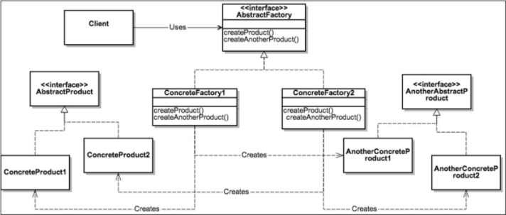

## 单例模式

单例模式：类只创建一个对象。

确保类**有且只有一个**特定类型的对象并提供全局访问点。单例模式通常用于下列情形，例如日志记录或数据库操作、打印机后台处理程序，以及其他程序——该程序运行过程中只能生成一个实例，以避免对同一资源产生相互冲突的请求。

- 确保类有且只有一个对象被创建。

- 为对象提供一个访问点，以使程序可以全局访问该对象。

- 控制共享资源的并行访问。

默认情况下，所有的模块都是单例，这是由Python的导入行为所决定的。

### 经典的单例模式

```python
class Singleton(object):
    def __new__(cls):
        if not hasattr(cls, 'instance'):
            cls.instance = super(Singleton, cls).__new__(cls)
        return cls.instance
```

> `__new__`方法（Python用于实例化对象的特殊方法）

### 懒汉式实例化

在导入模块的时候，我们可能会无意中创建一个对象，但当时根本用不到它。懒汉式实例化能够确保在实际需要时才创建对象。

```python
class Singleton:
    __instance = None
    def __init__(self):
        if not Singleton.__instance:
            print("__init__ method called..")
        else:
            print("Instance already created:", self.getInstance())
            
    @classmethod
    def getInstance(cls):
        if not cls.__instance:
            cls.instance = Singleton()
        return cls.__instance
```

执行s = singleton()的时候，它会调用__init__方法，但没有新的对象被创建。然而，实际的对象创建发生在调用Singleton.getInstance()的时候，我们正是通过这种方式来实现懒汉式实例化的。

### Monostate（单态）模式

让实例共享相同的状态。该概念基于所有对象共享相同状态。

Python使用`__dict__`存储一个类所有对象的状态。这里将类变量`__shared_state`赋给了变量`__dict__`

```python
class Borg:
    __shared_state = {"1":"2"}
    def __init__(self):
        self.x = 1
        self.__dict__ = self.shared_state
        pass

```

还可以通过修改__new__方法本身来实现Borg模式

```python
class Borg(object):
    _shared_state = {}
    def __new__(cls, *args, **kwargs):
        obj = super(Borg, cls).__new__(cls, *args, **kwargs)
        obj.__dict__ = cls._shared_state
        return obj
    
```

### 元类实现单例

由于元类对类创建和对象实例化有更多的控制权，所以它可以用于创建单例。（注意：为了控制类的创建和初始化，元类将覆盖`__new__`和`__init__`方法。）

```python
class MetaSingleton(type):
    _instances = {}
    def __call__(cls, *args, **kwargs):
        if cls not in cls._instances:
            cls._instances[cls] = super(MetaSingleton, cls).__call__(*args, **kwargs)
        return cls._instances[cls]


class Logger(metaclass=MetaSingleton):
    pass

```

### 缺点

虽然单例模式在许多情况下效果很好，但这种模式仍然存在一些缺陷。由于单例具有全局访问权限，因此可能会出现以下问题。

- 全局变量可能在某处已经被误改，但是开发人员仍然认为它们没有发生变化，而该变量还在应用程序的其他位置被使用。

- 可能会对同一对象创建多个引用。由于单例只创建一个对象，因此这种情况下会对同一个对象创建多个引用。

- 所有依赖于全局变量的类都会由于一个类的改变而紧密耦合为全局数据，从而可能在无意中影响另一个类。

## 工厂模式

术语“工厂”表示一个负责创建其他类型对象的类。通常情况下，作为一个工厂的类有一个对象以及与它关联的多个方法。客户端使用某些参数调用此方法，之后，工厂会据此创建所需类型的对象，然后将它们返回给客户端。

优点

- 松耦合，即对象的创建可以独立于类的实现。

- 客户端无需了解创建对象的类，但是照样可以使用它来创建对象。它只需要知道需要传递的接口、方法和参数，就能够创建所需类型的对象了。这简化了客户端的实现。

- 客户端无需了解创建对象的类，但是照样可以使用它来创建对象。它只需要知道需要传递的接口、方法和参数，就能够创建所需类型的对象了。这简化了客户端的实现。

- 可以轻松地在工厂中添加其他类来创建其他类型的对象，而这无需更改客户端代码。最简单的情况下，客户端只需要传递另一个参数就可以了。

- 工厂还可以重用现有对象。但是，如果客户端直接创建对象的话，总是创建一个新对象。

Factory模式有3种变体，如下所示。

- 简单工厂模式：允许接口创建对象，但不会暴露对象的创建逻辑。

- 工厂方法模式：允许接口创建对象，但使用哪个类来创建对象，则是交由子类决定的。

- 抽象工厂模式：抽象工厂是一个能够创建一系列相关的对象而无需指定/公开其具体类的接口。该模式能够提供其他工厂的对象，在其内部创建其他对象。

### 简单工厂模式

```python 
from abc import ABCMeta, abstractmethod
class Animal(metaclass=ABCMeta):
    @abstractmethod		# 抽象类，只能继承不能实例化
    def do_say(self):
        pass

    
class Dog(Animal):
    def do_say(self):
        print("汪....")

        
class Cat(Animal):
    def do_say(self):
        print("喵....") 
 

class ForestFactory(object):
    def make_sound(self, object_type):
        return object_type().do_say()


ff = ForestFactory()
ff.make_sound(Dog)

```

### 工厂方法模式


### 抽象工厂模式



```python
from abc import ABCMeta, abstractmethod

```


